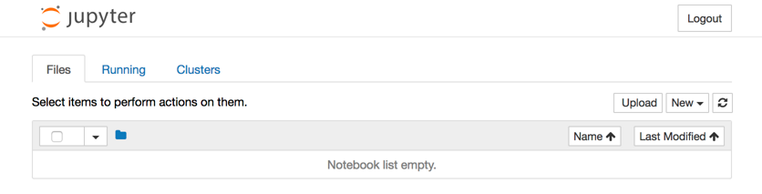

Working with rkt
----------------
The `rkt <https://github.com/rkt/rkt>`_ tool is a command line interface for
running ACI containers. It also supports running Docker containers from Docker
register download and automatic conversion to ACI with docker2aci_.

.. _docker2aci: https://github.com/appc/docker2aci

There is an introduction to using rkt in the :ref:`rkt-tutorial` below.
Alternatively, the `Getting Started with rkt`_ guide in the
`rkt documentation`_ is very helpful. If you are already familiar with Docker,
then this Medium post about `Moving from Docker to rkt`_ may also help you.

.. _Getting Started with rkt: https://coreos.com/rkt/docs/latest/getting-started-guide.html
.. _rkt documentation: https://coreos.com/rkt/docs/latest
.. _Moving from Docker to rkt: https://medium.com/@adriaandejonge/moving-from-docker-to-rkt-310dc9aec938

.. _rkt-tutorial:

Tutorial
~~~~~~~~
Build a Jupyter ACI container following the acbuild :ref:`acbuild-tutorial` if
you haven't already. This tutorial picks up from the end of that and
demonstrates how to run the container in rkt.

There should be a ``jupyter.aci`` in the current directory. Import this into
rkt using the ``fetch`` command.

::

    rkt --insecure-options=image fetch ./jupyter.aci

Since this is a large image, it will take some time for the container to be
imported. Once done, we can see it by listing the containers available in rkt.

::

    $ rkt image list
    ID                      NAME                                    SIZE    IMPORT TIME     LAST USED
    sha512-e1e9e1991658     woofwoofinc.dog/jupyter                 3.3GiB  4 minutes ago   4 minutes ago

Now start an instance of the container using ``rkt run``. Note that superuser
privileges are required for actually starting and running a container with rkt.

::

    sudo rkt run --port=http:80 woofwoofinc.dog/jupyter

This starts the container, running the Jupyter start command that we specified.
The ``port`` parameter makes the Jupyter server available on port 80 outside
the container.

Open a browser and connect to port 80 on the container. You should see a blank
Jupyter notebook system.

It is often useful to run a Bash shell on a container instead of the default
command. And similarly it is common to mount directories from the host to the
rkt container.

For an example of both, suppose we wanted to run a Jupyter server which
automatically included a set of notebooks from the host machine. The Jupyter
server can be configured to run with a base directory of our choice. We just
need to make it so that this location is available to the container.

For this, we use:

- The ``--interactive`` option to the ``rkt run`` to specify that we want to be
  able to type commands to the container.
- The ``--exec /bin/bash`` option to override the default command line in the
  container and run Bash instead. This gives us an interactive shell on the
  container instead of the default Jupyter server.
- ``--volume notebooks,kind=host,source=/hostmachine/path/to/notebooks``
  defines a storage named ``notebooks`` which we can mount to the container.
  It will be linked to the directory given in the ``source`` attribute.
- Finally, we use ``--mount volume=notebooks,target=/notebooks`` to add this
  storage inside the container under the path ``/notebooks``.

::

    sudo rkt run \
        --interactive \
        --port=http:80 \
        --volume notebooks,kind=host,source=/Users/docrualaoich/notebooks/ \
        woofwoofinc.dog/jupyter \
        --mount volume=notebooks,target=/notebooks \
        --exec /bin/bash

Alternatively, it is often easier to just change to the desired directory first
and use ``$(pwd)`` as the volume source.

::

    sudo rkt run \
        --interactive \
        --port=http:80 \
        --volume notebooks,kind=host,source=$(pwd) \
        woofwoofinc.dog/jupyter \
        --mount volume=notebooks,target=/notebooks \
        --exec /bin/bash

Once on the container, change to ``/notebooks`` to see the notebooks and start
Jupyter from that directory.

::

    cd /notebooks
    jupyter notebook --no-browser --allow-root --ip='*' --port=80 \
        --notebook-dir=/notebooks --NotebookApp.token=''

Browsing to port 80 on the container now will give a Jupyter server with the
notebooks already available.

The rkt Command
~~~~~~~~~~~~~~~
The rkt command comes with built in help pages:

::

    $ rkt --help
    NAME:
        rkt - rkt, the application container runner

    USAGE:
        rkt [command]

    VERSION:
        1.21.0

    COMMANDS:
        api-service         Run API service (experimental)
        cat-manifest        Inspect and print the pod manifest
        config              Print configuration for each stage in JSON format
        enter               Enter the namespaces of an app within a rkt pod
        export              Export an app from an exited pod to an ACI file
        fetch               Fetch image(s) and store them in the local store
        gc                  Garbage collect rkt pods no longer in use
        image cat-manifest  Inspect and print the image manifest
        image export        Export a stored image to an ACI file
        image extract       Extract a stored image to a directory
        image gc            Garbage collect local store
        image list          List images in the local store
        image render        Render a stored image to a directory with all its dependencies
        image rm            Remove one or more images with the given IDs or image names from the local store
        list                List pods
        metadata-service    Run metadata service
        prepare             Prepare to run image(s) in a pod in rkt
        rm                  Remove all files and resources associated with an exited pod
        run                 Run image(s) in a pod in rkt
        run-prepared        Run a prepared application pod in rkt
        status              Check the status of a rkt pod
        stop                Stop a pod
        trust               Trust a key for image verification
        version             Print the version and exit
        help                Help about any command

    DESCRIPTION:
        A CLI for running app containers on Linux.

        To get the help on any specific command, run "rkt help command".

    OPTIONS:
          --debug[=false]                   print out more debug information to stderr
          --dir=/var/lib/rkt                rkt data directory
          --insecure-options=none           comma-separated list of security features to disable.
                                            Allowed values: "none", "image", "tls", "ondisk", "http",
                                            "pubkey", "capabilities", "paths", "seccomp", "all-fetch",
                                            "all-run", "all"
          --local-config=/etc/rkt           local configuration directory
          --system-config=/usr/lib/rkt      system configuration directory
          --trust-keys-from-https[=false]   automatically trust gpg keys fetched from https
          --user-config=                    user configuration directory

If you are already running a rkt container then the running container can be
seen using the ``rkt list`` command.

::

    $ rkt list
    UUID        APP             IMAGE NAME                      STATE   CREATED     STARTED     NETWORKS
    c7d3aaca    dev-rktmachine  woofwoofinc.dog/dev-rktmachine  running 6 days ago  6 days ago  default:ip4=172.16.28.2

Stop a running container using ``rkt stop``.

.. NOTE::
   The ``rkt stop`` command is run as the superuser because root privileges are
   required to start/stop containers on a system. However, listing the
   containers as earlier is fine as a regular user since it only needs access
   to rkt management data, not kernel calls.

::

    $ sudo rkt stop c7d3aaca
    "c7d3aaca-8536-43f3-9b83-1ba8887b4fbb"

The container will show as exited in the list now.

::

    $ rkt list
    UUID        APP             IMAGE NAME                      STATE   CREATED     STARTED     NETWORKS
    c7d3aaca    dev-rktmachine  woofwoofinc.dog/dev-rktmachine  exited  6 days ago  6 days ago

Stopped containers can be removed permanently by running ``rkt gc``. This has a
default grace period of 30 minutes where stopped containers are not removed.
The garbage collection can be forced by setting the grace period to zero with
``--grace-period=0s``.

::

    $ sudo rkt gc --grace-period=0s
    Garbage collecting pod "c7d3aaca-8536-43f3-9b83-1ba8887b4fbb"

    $ rkt list
    UUID        APP             IMAGE NAME                      STATE   CREATED     STARTED     NETWORKS

To see container images available to run, use ``rkt image list``.

::

    $ rkt image list
    ID                  NAME                                SIZE    IMPORT TIME LAST USED
    sha512-e1e9e1991658 woofwoofinc.dog/dev-rktmachine      1.8GiB  6 days ago  6 days ago
    sha512-fdd18d9c2103 coreos.com/rkt/stage1-coreos:1.21.0 184MiB  6 days ago  6 days ago

It is common to start interactive containers for development workflows and
typically useful to mount directories, e.g. containing source code.

An example is:

::

    $ sudo rkt run \
        --interactive \
        --volume rktmachine,kind=host,source=$(pwd) \
        woofwoofinc.dog/dev-rktmachine \
        --mount volume=rktmachine,target=/rktmachine \
        --exec /bin/bash

In this case, the current working directory is mounted onto the container. On
the container, this directory is available at ``/rktmachine``.

Use ``exit`` to finish an interactive session.

.. NOTE::
   To exit a non-interactive container or a non-responsive interactive
   container, press Ctrl+] three times quickly.

To delete a container image entirely use ``rkt image rm``. This will mean that
new instances of the container cannot be started until the container is fetched
again.

::

    $ rkt image rm woofwoofinc.dog/dev-rktmachine
    successfully removed aci for image: "sha512-e1e9e1991658e3908f817164f01292ecaf44bed95e25167020c6cbe28d6b863b"
    rm: 1 image(s) successfully removed

The images can be garbage collected similarly to the running containers but
using the rkt image gc command instead.

::

   $ sudo rkt image gc
